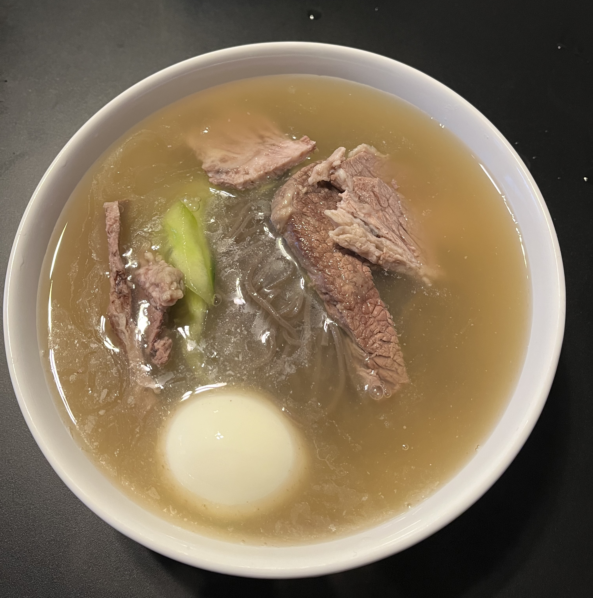
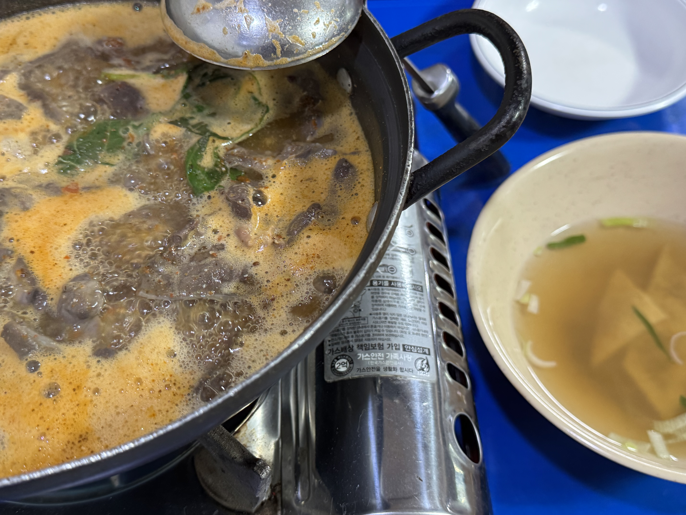
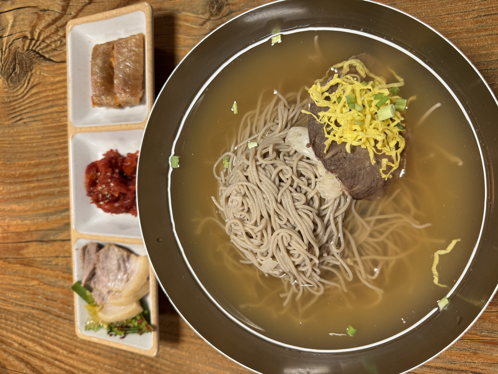
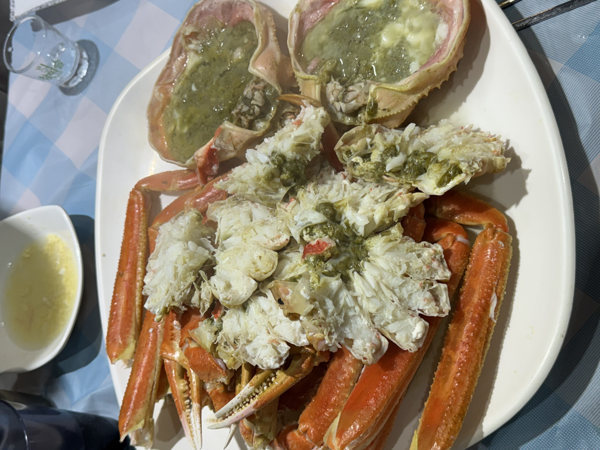

> 음식 결산!

---
### 오늘의 노래 🎵
<iframe
  width="560"
  height="315"
  src="https://www.youtube.com/embed/Pyr4HUpT1tg"
  title="🎵"
  frameborder="0"
  allow="accelerometer; autoplay; clipboard-write; encrypted-media; gyroscope; picture-in-picture; web-share"
  allowfullscreen>
</iframe>

### 음식을 같이 열어보쟈!! 🍕

첫번째는 바로바로 

전설의(?) 시작...

그 다음 뭐 먹었지?

두번째는 바로바로 

사실 기준은 없으니까 상아 생각 중인거 없다고 해도 실망하지 마시길.. 히히

그 다음 뭐 먹었지?

세번째애느으으은~ 

또 다른 전설의(?) 시작...

으햐 주향 또 먹고싶댜아아ㅏ

그 다음 뭐 먹었지?

말이 필요 없죠.. 최고 맛집...!! 

아 이게 아닌가? ㅋㅋㅋㅋㅋ

PASS!!!!

그 다음 뭐 먹었지?

개인적으로 까아아암짝! 놀랐던! 

으아ㅏㅏ 여기서부터 나 혼자 막 평냉 발동 걸렸자나

상아 학교가고 혼자 먹으러 갈정도로 쿠하하ㅏ

그 다음 뭐 먹었지?

이건 진짜 상아가 기다리고 있었던 것일거야

이건 진짜 전설이었다...

막 진짜 그 때 당시가 꿈만 같아 (literally)

그 다음 뭐 먹었지?

벌써 7번째 여기는 어딜까요?!

ああ！海仙洞ご存知だな。これはジイのおいしいです。さらに日本本国でも認められる北海道産ウニと鮭の卵がたっぷりあります。ああ、沈んだ。

그 다음 뭐 먹었지?

죄송해요. 흥분해서 그만! 하핫

빨리 귀국해보죠!

마!! 부산하믄 장으드빱 아이가!!! 가온나 쌔리 썩어뿌게

그 다음 뭐 먹었지?

이건 나의 골뱅이야.. (하고 쪼꼼 뿌듯했다는 뜻 ㅎㅎㅎ)

상아 진짜 잘먹더라.. 일본 여행의 여파인지 성게를 사랑하는 모습이 아주 인상적이었어 히힣

그 다음 뭐 먹었지?

이것도 즈으응말 맛있었지요옹

우리의 식비가 엄청나게 치솟기 시작(?)한 으흐흐

그 다음 뭐 먹었지?

상아 이거 까먹었다고 하면 엉엉 움..

수비드계의 새로운 지평을 열었다죠 하하

그 다음 뭐 먹었지?

상아 영업해서 너무너무 뿌듯했던!!

한국 귀국하면 평냉교수부부하자... 맨날 평냉투어!! 헤헤헷

그 다음 뭐 먹었지?

잠깐 Hey You..!

침 흘리는 것은 좋지만... 잊지 않으셨죠...?!?

저 기대합니다...!!

기대... 기대...

기대합니다!!

---

