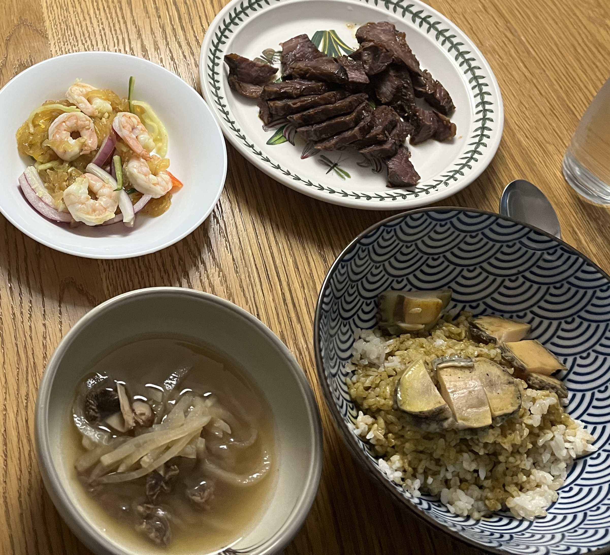

<section data-title="Page 09" style="line-height:1.7;">
  

  <blockquote style="margin:0 0 14px; padding:10px 14px; border-left:4px solid #d1d5db; background:#f9fafb;">
    음식 결산!
  </blockquote>
  

  <h3 style="margin:18px 0 10px;">오늘의 노래 🎵</h3>
  

    <iframe
      width="560"
      height="315"
      src="https://www.youtube.com/embed/Pyr4HUpT1tg"
      title="🎵"
      frameborder="0"
      allow="accelerometer; autoplay; clipboard-write; encrypted-media; gyroscope; picture-in-picture; web-share"
      allowfullscreen
      style="width:100%; aspect-ratio:16/9; height:auto; border-radius:10px;"
    ></iframe>
  

  <h3 style="margin:18px 0 10px;">음식을 같이 열어보쟈!! 🍕</h3>

  
첫번째는 바로바로

  
  
전설의(?) 시작... 진호표 평냉!!!

  <!-- Level 1 -->
  

    
그 다음 뭐 먹었지?

    

      
두번째는 바로바로 pittsburg McDonalds!

      
      
사실 기준은 없으니까 상아 생각 중인거 없다고 해도 실망하지 마시길.. 히히

      <!-- Level 2 -->
      

        
그 다음 뭐 먹었지?

        

          
세번째애느으으은~ 주향이다옹!!!!!

          
          
또 다른 전설의(?) 시작...

          
으햐 주향 또 먹고싶댜아아ㅏ

          <!-- Level 3 -->
          

            
그 다음 뭐 먹었지?

            

              
말이 필요 없죠.. 최고 맛집...!! 백!!소!!정!!

              
              
아 이게 아닌가? ㅋㅋㅋㅋㅋ

              
크흠흠...

              
<strong>PASS!!!! ㅋㅋㅋ</strong>

              <!-- Level 4 -->
              

                
그 다음 뭐 먹었지?

                

                  
개인적으로 까아아암짝! 놀랐던! 잘빠진메밀이다옹

                  
                  
으아ㅏㅏ 여기서부터 나 혼자 막 평냉 발동 걸렸자나

                  
상아 학교가고 혼자 먹으러 갈정도로 쿠하하ㅏ

                  <!-- Level 5 -->
                  

                    
그 다음 뭐 먹었지?

                    

                      
이건 진짜 상아가 기다리고 있었던 것일거야

                      
바로 대게대게 맛있는 대게!!

                      
                      
이건 진짜 전설이었다...

                      
막 진짜 그 때 당시가 꿈만 같아 (literally)

                      <!-- Level 6 -->
                      

                        
그 다음 뭐 먹었지?

                        

                          
벌써 7번째 여기는 어딜까요?!

                          
                          

                            ああ！海仙洞ご存知だな。これはジイのおいしいです。さらに日本本国でも認められる北海道産ウニと鮭の卵がたっぷりあります。ああ、沈んだ。
                          

                          <!-- Level 7 -->
                          

                            
그 다음 뭐 먹었지?

                            

                              
죄송해요. 흥분해서 그만! 하핫

                              
빨리 귀국해보죠!

                              
                              
마!! 부산하믄 장으드빱 아이가!!! 가온나 쌔리 썩어뿌게

                              <!-- Level 8 -->
                              

                                
그 다음 뭐 먹었지?

                                

                                  
이건 나의 골뱅이야.. (하고 쪼꼼 뿌듯했다는 뜻 ㅎㅎㅎ)

                                  
야무지게 먹던 우니 n 단새우 set!

                                  
                                  
상아 진짜 잘먹더라.. 일본 여행의 여파인지 성게를 사랑하는 모습이 아주 인상적이었어 히힣

                                  <!-- Level 9 -->
                                  

                                    
그 다음 뭐 먹었지?

                                    

                                      
이것도 즈으응말 맛있었지요옹

                                      
지글지글 장어구이...!!

                                      
                                      
우리의 식비가 엄청나게 치솟기 시작(?)한 으흐흐

                                      <!-- Level 10 -->
                                      

                                        
그 다음 뭐 먹었지?

                                        

                                          
상아 이거 까먹었다고 하면 엉엉 움..

                                          
JH's FineDining..❣

                                          
                                          
수비드계의 새로운 지평을 열었다죠 하하

                                          <!-- Level 11 -->
                                          

                                            
그 다음 뭐 먹었지?

                                            

                                              
상아 영업해서 너무너무 뿌듯했던!!

                                              
평양냉면!!!

                                              
                                              
한국 귀국하면 평냉교수부부하자... 맨날 평냉투어!! 헤헤헷

                                              <!-- Level 12 (final) -->
                                              

                                                
그 다음 뭐 먹었지?

                                                

                                                  
잠깐 Hey You..!

                                                  
지금 너무 침흘리고 있지는 않나요..?!

                                                  
                                                  

                                                    침 흘리는 것은 좋지만... 잊지 않으셨죠...?!?  
                                                    저 기대합니다...!! 
                                                    그거 기대... 기대...  
                                                    <strong>기대합니다!!</strong>
                                                  

                                                

                                              

                                              <!-- /Level 12 -->

                                            

                                          

                                          <!-- /Level 11 -->

                                        

                                      

                                      <!-- /Level 10 -->

                                    

                                  

                                  <!-- /Level 9 -->

                                

                              

                              <!-- /Level 8 -->

                            

                          

                          <!-- /Level 7 -->

                        

                      

                      <!-- /Level 6 -->

                    

                  

                  <!-- /Level 5 -->

                

              

              <!-- /Level 4 -->

            

          

          <!-- /Level 3 -->

        

      

      <!-- /Level 2 -->

    

  

  <!-- /Level 1 -->

  

</section>
